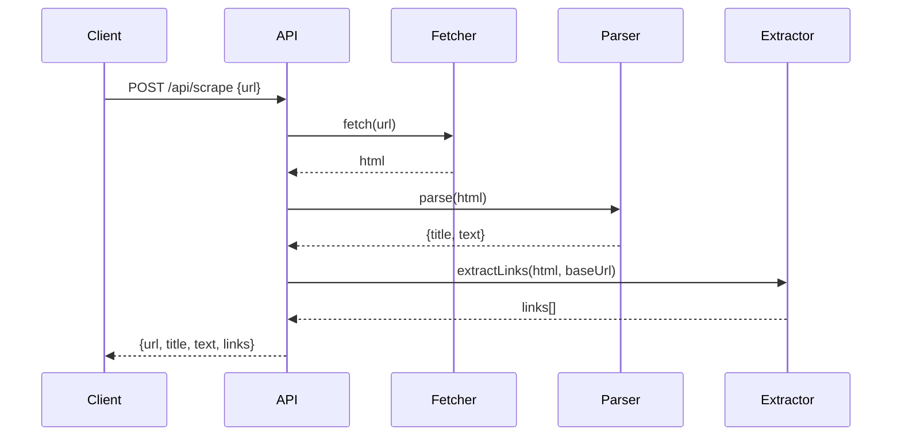
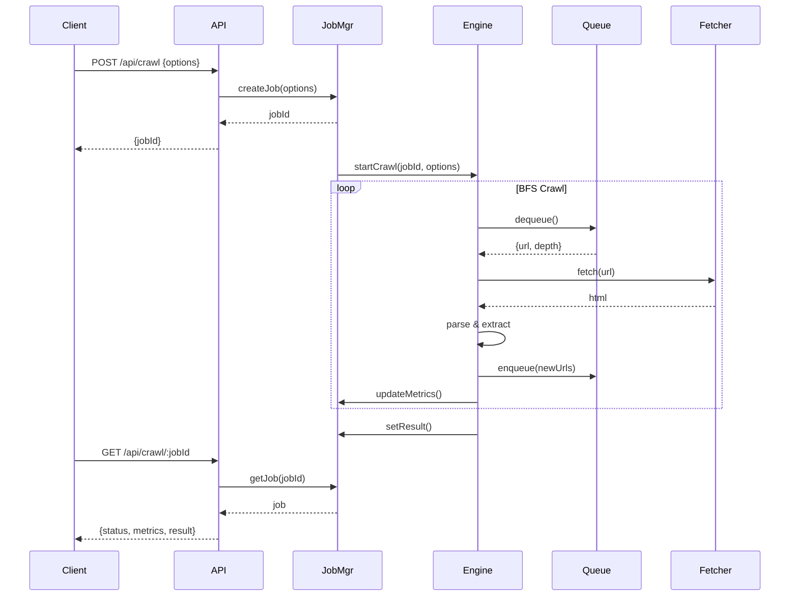

# DeepCrawler Architecture Guide

## System Overview

DeepCrawler is built on a **modular, queue-based architecture** that separates concerns and enables scalability. The system uses a **BFS (Breadth-First Search)** algorithm for crawling and enforces strict limits to ensure politeness and safety.

## Core Design Principles

1. **Separation of Concerns**: Each module has a single, well-defined responsibility
2. **Interface Abstractions**: Storage and queue interfaces allow future backend swapping
3. **Type Safety**: Strong TypeScript typing throughout
4. **Testability**: Pure functions and dependency injection
5. **Scalability**: Designed for Redis and worker pool migration

## Component Architecture

### 1. API Layer

**Location**: `src/api/`

```typescript
// Route structure
POST   /api/scrape          # Single URL
POST   /api/scrape/batch    # Multiple URLs
POST   /api/crawl           # Start crawl job
GET    /api/crawl/:jobId    # Job status
GET    /api/crawl/:jobId/result  # Job result
GET    /health              # Health check
```

**Responsibilities**:
- Request validation using Zod
- Route handling
- Response formatting
- Error handling

**Key principle**: No business logic in routes - delegate to services

### 2. Crawler Engine

**Location**: `src/crawler/engine.ts`

The heart of DeepCrawler. Orchestrates the crawl process.

```typescript
interface CrawlOptions {
  startUrl: string;
  strategy: 'domain' | 'all';
  maxDepth: number;
  maxPages: number;
  concurrency: number;
  timeout: number;
}

interface CrawlResult {
  jobId: string;
  pagesScraped: number;
  linksDiscovered: number;
  duration: number;
  errors: CrawlError[];
  pages: PageData[];
}
```

**Algorithm**:
1. Initialize queue with start URL at depth 0
2. While queue is not empty AND limits not reached:
   - Dequeue URL
   - Check if visited
   - Fetch and parse
   - Extract links
   - Filter by strategy
   - Enqueue new URLs with depth + 1
3. Aggregate results and metrics

### 3. Queue System

**Location**: `src/crawler/queue.ts`

BFS queue implementation with interface for future Redis migration.

```typescript
interface IQueue<T> {
  enqueue(item: T): void;
  dequeue(): T | undefined;
  isEmpty(): boolean;
  size(): number;
  clear(): void;
}

// Item structure
interface QueueItem {
  url: string;
  depth: number;
  parentUrl?: string;
}
```

**Current**: In-memory array  
**Future**: Redis list with `LPUSH`/`RPOP`

### 4. URL Management

**Location**: `src/crawler/normalizer.ts`

Ensures URLs are consistent and deduplicated.

**Normalization steps**:
1. Parse URL
2. Convert to lowercase
3. Remove trailing slash
4. Remove default ports (80, 443)
5. Sort query parameters
6. Remove fragments (#)
7. Decode percent-encoding where safe

**Example**:
```
Input:  https://Example.COM/Page?b=2&a=1#section
Output: https://example.com/page?a=1&b=2
```

### 5. Visited Set

**Location**: Part of engine state

Tracks processed URLs to prevent duplicates.

```typescript
interface IVisitedStore {
  has(url: string): boolean;
  add(url: string): void;
  size(): number;
  clear(): void;
}
```

**Current**: JavaScript `Set`  
**Future**: Redis set with `SADD`/`SISMEMBER`

### 6. Fetcher

**Location**: `src/crawler/fetcher.ts`

Handles HTTP requests using Undici.

```typescript
interface FetchOptions {
  timeout: number;
  maxSize: number;
  userAgent: string;
}

interface FetchResult {
  url: string;
  statusCode: number;
  html: string;
  contentType: string;
  size: number;
}
```

**Features**:
- Request timeout
- Response size limiting
- Custom User-Agent
- Error handling
- Redirect following (up to limit)

### 7. Parser

**Location**: `src/crawler/parser.ts`

Extracts structured data from HTML using Cheerio.

```typescript
interface ParsedPage {
  title: string;
  text: string;
  links: string[];
  meta: {
    description?: string;
    keywords?: string[];
  }
}
```

**Extraction logic**:
- Title: `<title>` tag or `<h1>`
- Text: All visible text (excluding scripts, styles)
- Links: All `<a href>` attributes
- Meta: Meta tags for description and keywords

### 8. Link Extractor

**Location**: `src/crawler/extractor.ts`

Discovers and normalizes links from parsed HTML.

**Process**:
1. Extract all `href` attributes from `<a>` tags
2. Resolve relative URLs against base URL
3. Filter out:
   - Non-HTTP(S) protocols (mailto:, tel:, javascript:)
   - Invalid URLs
   - Self-references
4. Normalize each URL
5. Return unique set

### 9. Rules Engine

**Location**: `src/crawler/rules.ts`

Enforces crawl limits and filters.

```typescript
interface CrawlRules {
  shouldCrawl(url: string, depth: number): boolean;
  isAllowedDomain(url: string, baseUrl: string): boolean;
  isPrivateUrl(url: string): boolean;
}
```

**Checks**:
- Depth limit
- Page limit
- Domain restriction (if enabled)
- Private IP filtering
- Protocol validation

### 10. Job Manager

**Location**: `src/jobs/job-manager.ts`

Manages crawl job lifecycle and progress.

```typescript
interface Job {
  id: string;
  status: 'pending' | 'running' | 'completed' | 'failed';
  startTime: number;
  endTime?: number;
  options: CrawlOptions;
  metrics: JobMetrics;
  result?: CrawlResult;
  error?: string;
}

interface JobMetrics {
  pagesScraped: number;
  linksDiscovered: number;
  errors: number;
  currentDepth: number;
}
```

**Current**: In-memory Map  
**Future**: Redis hash with TTL

## Data Flow

### Single URL Scrape



### Crawl Job



## Concurrency Model

DeepCrawler uses a **controlled concurrency** model:

```typescript
// Pseudocode
const activeRequests = new Set<Promise>();
const maxConcurrency = options.concurrency;

while (queue.size() > 0 || activeRequests.size > 0) {
  while (activeRequests.size < maxConcurrency && queue.size() > 0) {
    const item = queue.dequeue();
    const promise = processUrl(item);
    activeRequests.add(promise);
    
    promise.finally(() => activeRequests.delete(promise));
  }
  
  await Promise.race(activeRequests);
}
```

**Benefits**:
- Controlled resource usage
- Prevents overwhelming targets
- Predictable performance

## Rate Limiting

Uses **Bottleneck** for per-domain rate limiting:

```typescript
import Bottleneck from 'bottleneck';

const limiters = new Map<string, Bottleneck>();

function getLimiter(domain: string): Bottleneck {
  if (!limiters.has(domain)) {
    limiters.set(domain, new Bottleneck({
      maxConcurrent: 2,      // Max 2 concurrent requests
      minTime: 100,          // Min 100ms between requests
    }));
  }
  return limiters.get(domain)!;
}

// Usage
const limiter = getLimiter(domain);
await limiter.schedule(() => fetch(url));
```

## Error Handling Strategy

### 1. Network Errors
- Timeout: Record error, continue crawl
- DNS failure: Record error, skip URL
- Connection refused: Record error, skip URL

### 2. HTTP Errors
- 4xx: Record error, skip URL
- 5xx: Record error, optionally retry
- 3xx: Follow redirects (up to limit)

### 3. Parse Errors
- Invalid HTML: Extract what's possible
- No content: Record as empty page
- Binary content: Skip extraction

**Principle**: Fail gracefully, continue crawl, report all errors

## Scalability Path

### Current (Phase 1-8)
```
┌─────────┐
│ Fastify │
│   API   │
└────┬────┘
     │
┌────▼────────┐
│ Job Manager │ (in-memory Map)
└────┬────────┘
     │
┌────▼────────┐
│   Engine    │
└─────────────┘
     │
┌────▼────────┐
│    Queue    │ (in-memory Array)
│  Visited    │ (in-memory Set)
└─────────────┘
```

### Future: Redis Integration
```
┌─────────┐
│ Fastify │
│   API   │
└────┬────┘
     │
┌────▼────────┐
│ Job Manager │──────► Redis Hash
└────┬────────┘       (job:*)
     │
┌────▼────────┐
│   Engine    │
└─────────────┘
     │
┌────▼────────┐
│    Queue    │──────► Redis List
│  Visited    │──────► Redis Set
└─────────────┘
```

### Future: Worker Pool
```
┌─────────┐
│ Fastify │
│   API   │
└────┬────┘
     │
     ▼
┌──────────┐      ┌─────────┐
│  Redis   │◄────►│ Worker  │
│  Broker  │      │  Pool   │
└──────────┘      └─────────┘
     ▲                 │
     │                 ▼
     └────────────► Engine
```

## Configuration

All configuration via environment variables:

```bash
# Server
PORT=3000
HOST=0.0.0.0

# Crawler defaults
DEFAULT_MAX_DEPTH=3
DEFAULT_MAX_PAGES=100
DEFAULT_CONCURRENCY=5
DEFAULT_TIMEOUT=10000

# Rate limiting
RATE_LIMIT_MAX_CONCURRENT=2
RATE_LIMIT_MIN_TIME=100

# Safety
MAX_RESPONSE_SIZE=10485760  # 10MB
USER_AGENT="DeepCrawler/1.0"
RESPECT_ROBOTS_TXT=false
```

## Testing Strategy

### Unit Tests
- URL normalization
- Link extraction
- Queue operations
- Rules validation

### Integration Tests
- Fetcher with mock server
- Parser with fixture HTML
- Engine with controlled data

### E2E Tests
- Full crawl workflow
- API endpoints
- Job lifecycle

---

**Next**: See [API.md](./API.md) for detailed API documentation.
