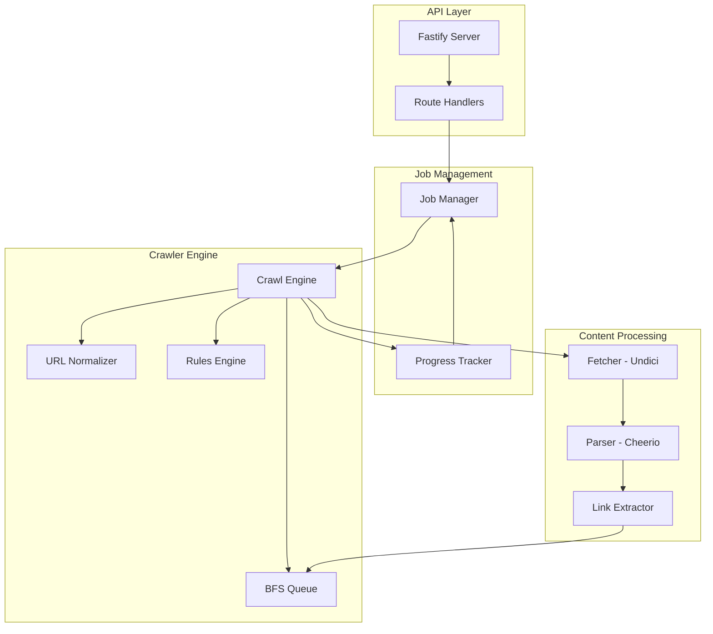

# DeepCrawler Project Documentation

## Overview

DeepCrawler is a production-ready web crawler API built with Node.js and TypeScript. It supports single URL scraping, batch processing, and intelligent crawling with configurable strategies and safety limits.

## 🎯 Project Goals

- **Single URL Scraping**: Extract content, title, text, and links from any URL
- **Batch Scraping**: Process multiple URLs concurrently with aggregated results
- **Intelligent Crawling**: Two crawl strategies:
  - **Domain-only**: Stay within the same domain
  - **Full-link**: Follow all discovered links
- **Progress Tracking**: Monitor crawl jobs in real-time via job IDs
- **Scalable Design**: Architecture ready for Redis and worker pools

## 🧱 Technology Stack

| Component | Technology | Purpose |
|-----------|-----------|---------|
| Runtime | Node.js 20+ | Modern JavaScript runtime |
| Language | TypeScript | Type safety and better DX |
| API Framework | Fastify | High-performance HTTP server |
| HTTP Client | Undici | Fast, modern HTTP client |
| HTML Parser | Cheerio | jQuery-like HTML parsing |
| Validation | Zod | Schema validation |
| Rate Limiting | Bottleneck | Request rate control |
| Browser (Optional) | Playwright | Fallback for JS-heavy sites |

## 🏗 Architecture

DeepCrawler follows a modular, layered architecture:



### Key Components

#### API Layer
- **Fastify Server**: Handles HTTP requests and responses
- **Route Handlers**: Clean separation of routes and business logic

#### Job Management
- **Job Manager**: Creates, tracks, and manages crawl jobs
- **Progress Tracker**: Real-time metrics and status updates

#### Crawler Engine
- **Crawl Engine**: Orchestrates the entire crawl process
- **BFS Queue**: Breadth-first search implementation
- **URL Normalizer**: Ensures consistent URL format
- **Rules Engine**: Enforces limits and filters

#### Content Processing
- **Fetcher**: Downloads HTML content using Undici
- **Parser**: Extracts structured data using Cheerio
- **Link Extractor**: Discovers and normalizes links

## 📁 Project Structure

```
DeepCrawler/
├── src/
│   ├── api/
│   │   └── routes/
│   │       ├── crawl.ts          # Crawl endpoints
│   │       └── status.ts         # Status endpoints
│   ├── crawler/
│   │   ├── engine.ts             # Main crawl orchestrator
│   │   ├── queue.ts              # BFS queue implementation
│   │   ├── rules.ts              # Crawl rules and filters
│   │   ├── metrics.ts            # Progress tracking
│   │   ├── fetcher.ts            # HTTP fetching
│   │   ├── parser.ts             # HTML parsing
│   │   ├── extractor.ts          # Link extraction
│   │   └── normalizer.ts         # URL normalization
│   ├── jobs/
│   │   └── job-manager.ts        # Job lifecycle management
│   ├── utils/
│   │   ├── logger.ts             # Logging utilities
│   │   └── timer.ts              # Timing utilities
│   ├── types/
│   │   └── crawl.ts              # TypeScript types
│   └── server.ts                 # Entry point
├── tests/
├── .env.example
├── tsconfig.json
├── package.json
└── README.md
```

## 🔁 Crawling Strategies

### Domain-Only Crawling
Stays within the same domain as the starting URL.

**Use cases:**
- Site mapping
- Content auditing
- SEO analysis

**Example:**
```
Start: https://example.com/page1
✓ https://example.com/page2
✓ https://example.com/blog/post
✗ https://other-site.com/page
```

### Full-Link Crawling
Follows all discovered links regardless of domain.

**Use cases:**
- Web archiving
- Research
- Discovery

**Example:**
```
Start: https://example.com/page1
✓ https://example.com/page2
✓ https://other-site.com/page
✓ https://third-site.com/resource
```

## 🚦 Safety & Politeness

DeepCrawler implements several safety mechanisms:

- **Request Timeout**: Prevents hanging on slow sites
- **Max Response Size**: Limits memory usage
- **Rate Limiting**: Prevents overwhelming servers
- **User-Agent**: Identifies the crawler
- **Concurrency Limits**: Controls parallel requests
- **Depth Limits**: Prevents infinite crawls
- **Page Limits**: Caps total pages scraped
- **robots.txt**: Optional respect for site preferences
- **IP Filtering**: Blocks private/localhost crawling

## 📊 Metrics & Tracking

Each crawl job tracks:

| Metric | Description |
|--------|-------------|
| `pagesScraped` | Total pages successfully processed |
| `linksDiscovered` | Unique links found |
| `errors` | Count and details of failures |
| `depth` | Current and maximum depth reached |
| `duration` | Total crawl time |
| `status` | Current job state |

## 🔮 Future Scalability

The architecture is designed for future enhancements:

### Phase 1: Redis Integration
- Move queue to Redis
- Distributed visited set
- Persistent job storage

### Phase 2: Worker Pools
- Separate API and workers
- Horizontal scaling
- Load balancing

### Phase 3: Advanced Features
- JavaScript rendering (Playwright)
- Content extraction rules
- Data export formats
- Webhook notifications

## 📝 Development Phases

The project is built in 8 phases:

1. **Project Setup** - Initialize tooling and health endpoint
2. **Single URL Scraper** - Core scraping functionality
3. **Batch Scraping** - Concurrent processing
4. **Crawl Engine** - BFS algorithm and strategies
5. **Job System** - Progress tracking and status
6. **Safety & Politeness** - Rate limiting and guards
7. **Redis Readiness** - Interface abstractions
8. **Documentation** - Comprehensive guides and examples

## ✅ Success Criteria

The project is complete when:

- ✅ Crawl jobs can be started via API
- ✅ Progress can be queried in real-time
- ✅ Domain and limit restrictions are enforced
- ✅ Results include discovered links and metrics
- ✅ System is ready for Redis and worker migration
- ✅ Documentation is comprehensive and clear

## 🔗 Quick Links

- [Architecture Guide](./ARCHITECTURE.md)
- [API Documentation](./API.md)
- [Development Guide](./DEVELOPMENT.md)
- [Task Breakdown](./task.md)

---

**Next Steps**: See [task.md](./task.md) for the complete development checklist.
